# local-video: a text-to-film rig that runs entirely on one Mac

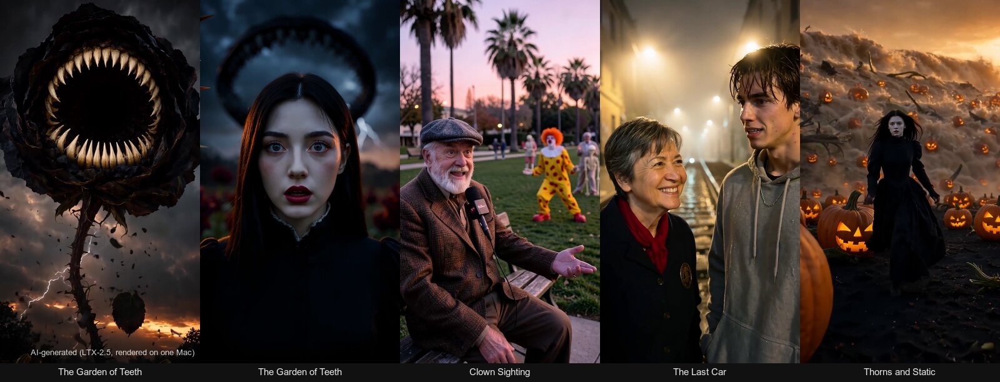

<sub>AI-generated (LTX-2.5 video; portraits and first frames by FLUX.2 klein / Qwen-Image), all on a MacBook Pro M5 Max with no cloud service involved.</sub>

A one-message brief goes in and a 1-3 minute vertical film with spoken dialogue comes out, made with no network and
no cloud GPU. **LTX-2.5** renders each shot's picture and sound together. A **local LLM** (DeepSeek V4 Flash Vision
or Qwen3.8 on the same machine) acts as the director through the [pi](https://github.com/badlogic/pi-mono) agent: it
writes the project file, renders, reviews contact sheets and orders retakes. Automated gates check every shot: a
**dialogue-sync meter** (Demucs + SyncNet, calibrated on planted offsets), a face and pixel pre-check, and a
transcript of what each line actually says. The harness's main job is keeping the GPU sane. A 93 GB director model
and a 45 GB video model cannot share one GPU, so the director sleeps through every render and wakes in about 13
seconds.

About 8,000 lines of Python, zsh, TypeScript and Swift, built and measured between 2026-09-22 and 2026-10-05.

## Watch

Click a poster to play the 8-second shot with its sound. The dialogue sync is the whole point, and a GIF can't carry
it. Each one is a single rendered take as it appears in the film, only resized and labelled. Under each poster:
the line as written, then the sync gate's reading (offset in ms, negative = voice slightly late; SyncNet confidence,
pass bar 4.2).

| Clown Sighting, shot 7 | Clown Sighting, shot 6 | The Last Car, shot 3 | The Garden of Teeth, shot 8 |
|---|---|---|---|
| [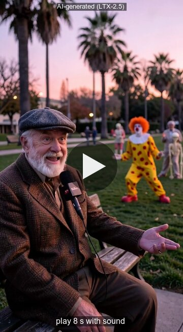](docs/media/clown-sighting-shot7.mp4) | [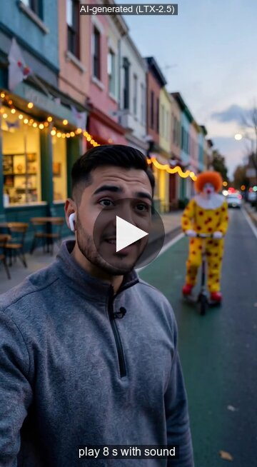](docs/media/clown-sighting-shot6.mp4) | [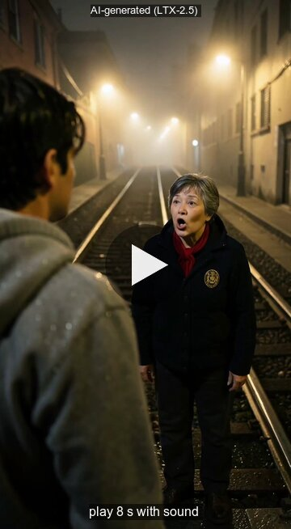](docs/media/the-last-car-shot3.mp4) | [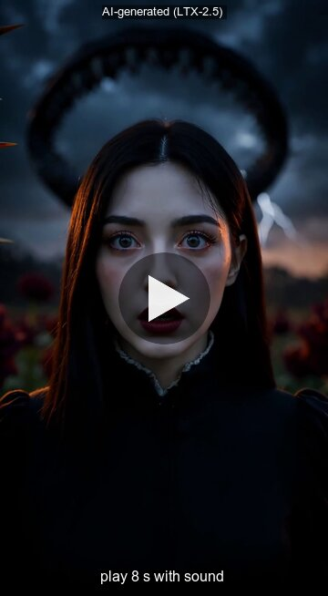](docs/media/garden-of-teeth-shot8.mp4) |
| *"Fifty-one years in the Mission. A clown, I can handle. It's the rent."* -42 ms, conf 10.1 | *"Honestly? He's the first person in this city who's made eye contact with me."* -18 ms, conf 8.3 | *"The last car's gone. That's the joke: I drive the thing, and I still have to walk it."* -52 ms, conf 9.8 | *"It's awake. Mother said if it ever woke, I run to the sea."* -56 ms, conf 7.6 |

Without sound:

| The rose wakes (Garden of Teeth, shot 7) | The flood (Garden of Teeth, shot 22) | Live from the cable-car line (Clown Sighting, shot 9) |
|---|---|---|
| 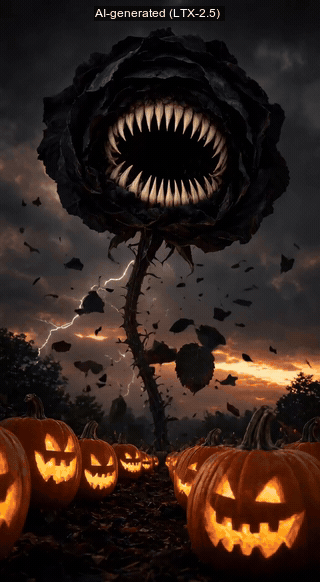 | 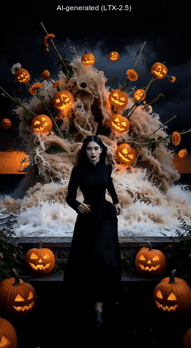 | 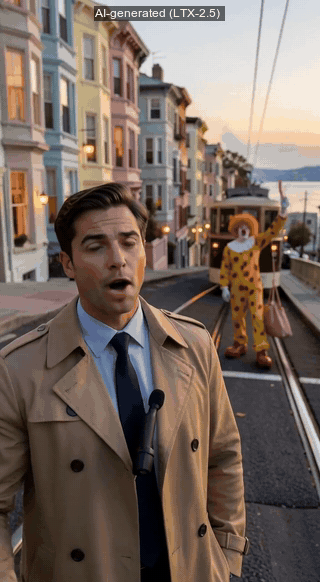 |

The films:
- **Clown Sighting** (175 s, 22 shots): a straight-faced Halloween-week local news report. Eleven witnesses describe
  the clown's week while, behind every one of them, the clown does something absurd that nobody notices.
- **The Garden of Teeth** (169 s, 24 shots): a gothic fairy tale about a girl who breaks her mother's three rules
  crossing a garden of giant flowers.
- **The Last Car** (64 s, 8 shots): a cable-car operator walks a lost tourist up the hill. The local director wrote
  and directed this one itself.
- **Thorns and Static** (171 s, 24 shots, in the hero image): the first telling of the gothic fairy tale that The
  Garden of Teeth retold with one consistent face.

Claude Code wrote the screenplays for Clown Sighting and The Garden of Teeth. The local director planned, rendered,
reviewed and redid the shots without help.

### One shot, end to end

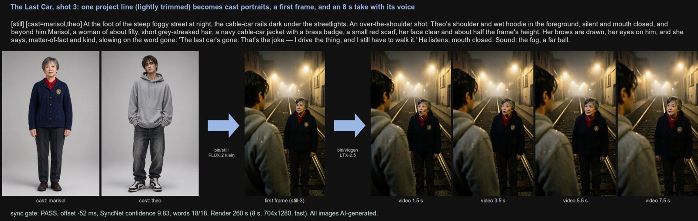

This is what `stories/story.sh` printed while it made that shot. It's the real log from 2026-10-04, trimmed, with
paths shortened:

```console
--- cast portrait marisol 08:17
--- cast portrait theo 08:18
--- scene 3 still 08:30 704x1280 seed 8811 --ref ~/Videos/vidgen/the-last-car/cast-marisol.png --ref ~/Videos/vidgen/the-last-car/cast-theo.png
--- scene 3/8 08:30 anchor=none mode=fast still=still-3.png
[Loading text encoder (Gemma)] done in 1.2s
[Encoding prompt] done in 1.1s
[Loading transformer (transformer-distilled.safetensors)] done in 0.6s
Mode: Distilled Two-Stage (half-res + upscale + distilled refine)
Denoising (ancestral):  88%|████████▊ | 7/8 [01:05<00:09,  9.32s/it]
Denoising: 100%|██████████| 3/3 [02:33<00:00, 51.31s/it]
[vae-decode tiling] peak Metal memory 52.68 GB
[Decoding video + audio + muxing] done in 36.4s
→ scene-3.mp4  [ltx-2.5-mlx-q8, fast]
done in 260.5s → ~/Videos/vidgen/the-last-car/scene-3.mp4
sync 3: PASS, offset -52 ms (audio late), conf 9.83, coverage 1.00, words 18/18 [in sync] → keep
...
sync 8: PASS, offset -23 ms (audio late), conf 9.66, coverage 1.00, words 10/10 [in sync] → keep
DONE the-last-car → ~/Videos/vidgen/the-last-car/the-last-car.mp4
drift OK: video 64.333 s, audio 64.362 s played back to back (64.355 s by timestamps); 0 audio and 0 video timestamp gaps; worst drift 0 ms (tolerance 20 ms)
Dialogue sync gate (meter v3, ...): 8/8 on-screen dialogue shots PASS
```

### What the director sees

After each batch the director gets a contact sheet like this (four frames per shot), the pre-check verdicts, the
transcript and the sync result. It then decides which shots to redo.

<p>
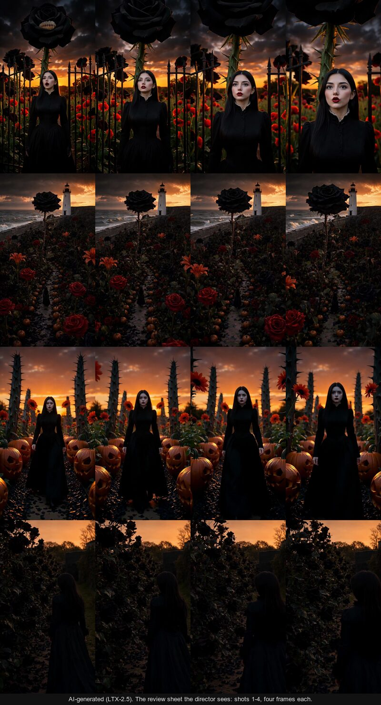
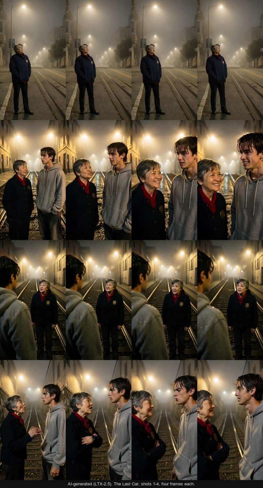
</p>

## How it works

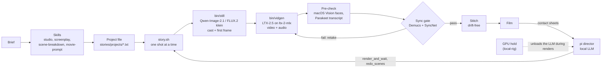

1. **Plan.** The skills (`skills/`) turn the brief into a screenplay and then into a project file: one line per
   continuous shot, with a fixed one-sentence description of every recurring character, a style sentence and a sound
   bed. Claude Code and pi load the same skill files.
2. **Draw first frames.** `bin/still` draws each shot's opening frame with Qwen-Image-2.1, or composes it from the cast
   portraits with FLUX.2 klein, so a character keeps one face across 24 shots.
3. **Render.** `bin/vidgen` runs LTX-2.5 (22B, int8) through the pure-MLX engine
   [ltx-2-mlx](https://github.com/dgrauet/ltx-2-mlx): image-to-video from that frame, with synchronized dialogue and
   ambience generated in the same pass.
4. **Gate.** Every dialogue clip is measured on the CPU right after it renders. If the mouth does not follow the
   voice, the shot is re-rendered with a new video seed (same first frame, up to three takes). The stitch refuses a
   film with an unsynced line unless the director records an exception.
5. **Direct.** A pi extension (`rig/film-rig.ts`) gives the local model four tools: `render_and_wait`,
   `review_scenes`, `redo_scenes` and `keep_take`. It also has guards: bash cannot start renders or touch model
   servers, and an image is shown once and then replaced by a note. Every tool takes the Mac's GPU hold and unloads
   the director before any GPU job.

More detail: [docs/architecture.md](docs/architecture.md) (pipeline, a render as a sequence diagram, models and
memory) and [docs/dialogue-sync.md](docs/dialogue-sync.md) (the meter, the gate, the drift bug, the shot lab).
[APPARATUS.md](APPARATUS.md) is the file-by-file map.

## Results

All numbers come from files in [`docs/data/`](docs/data/), and
[`docs/charts/make_charts.py`](docs/charts/make_charts.py) redraws every chart from them. Failures are left in.

### The sync meter, on planted truth


Every planted offset from -400 to +400 ms was recovered within 10 ms, on our own LTX clips and on real actors
(RAVDESS). The confidence bar of 4.2 sits above every frozen mouth and every swap to different words, and below every
real in-sync take. On SyncNet's own published reference clip the meter reads +123 ms, against the published +120 ms.

### Which shots can carry a line: the shot lab


The lab held the speaker, the line and the delivery fixed and changed one thing at a time, across 35 kinds of shot
with two seeds each and first takes only. **66 of 69 were in sync.** Profiles, walk-and-talks, an orbiting camera,
laughing, whispering, a coffee sip mid-line and a painted clown all passed. Every miss was a face under 70 px. The
old rule "close-ups only" turned out to be a measurement artefact. The shot mosaic is in
[docs/dialogue-sync.md](docs/dialogue-sync.md#5-the-shot-lab-which-shots-can-carry-a-line).

### Per film, and the drift bug


Every film before 2026-10-03 drifted. The per-shot meter said "Warm" was 13/13 in sync, yet its voice ran 2.2 s
ahead of the lips by the end. The old stitch left a ~90 ms audio gap at every cut, Apple players skip those gaps,
and any per-shot measurement re-anchors at each cut, so it couldn't see the drift. Since the fix every film measures
0 ms. The iteration-9 film is the worst result since the gate landed (4 of 8 lines on the first take, 2 accepted as
exceptions). It is counted here, but its footage is not published.

### Render time

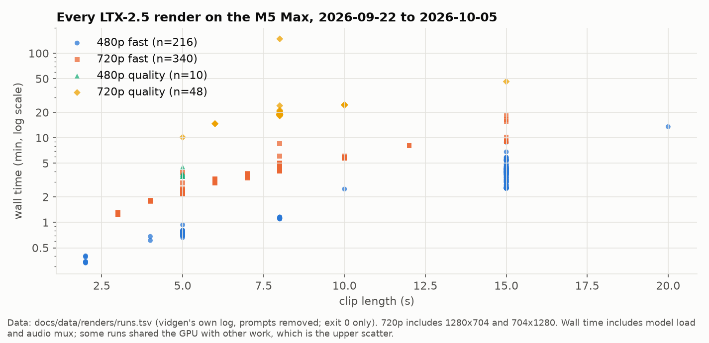

Medians from 614 renders: an 8 s 720p portrait clip in fast mode takes 260 s (n = 232), and 5 s at 480p takes 43 s
(n = 49). Quality mode costs about 4-5x. So a 24-shot, 3-minute film is about 1.7 hours of GPU time before any
retakes. The upper scatter is renders that shared the GPU with something else, which is why the rig now enforces one
GPU job at a time.

### Who writes the screenplay: a blind-judged bench

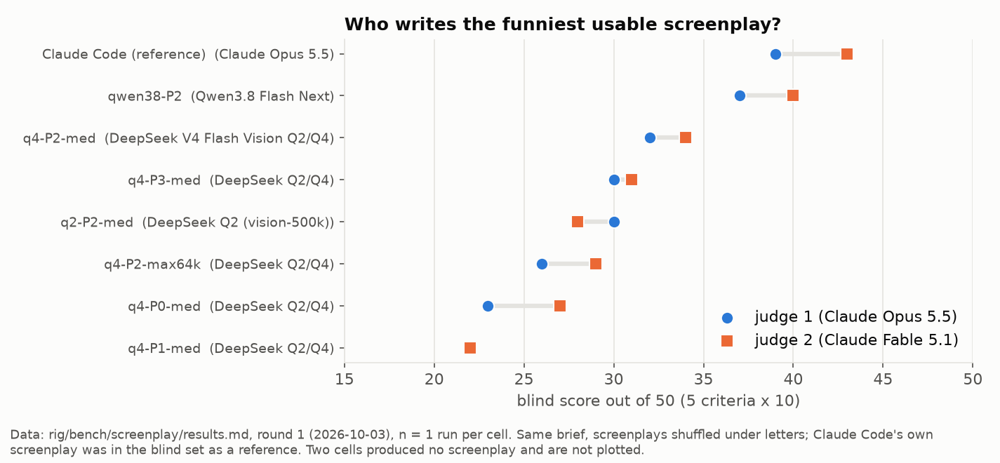

Every run got the same brief. Two judges, Claude Opus 5.5 and Claude Fable 5.1, scored the shuffled screenplays
blind. The best local writer, Qwen3.8 Flash Next with a craft prompt, came close to Claude Code's own screenplay
(77 vs 82 of 100). The prompt mattered more than the model or the amount of thinking. With n = 1 per cell this shows
a direction, not a measurement ([rig/bench/screenplay/results.md](rig/bench/screenplay/results.md)).

## Requirements

- **Apple Silicon with 128 GB of unified memory.** Developed on a MacBook Pro M5 Max (40-core GPU) running macOS 27. A
  720p render peaks at 44.5 GB and the DeepSeek director at about 93 GB, and the two never run at once. A single
  `vidgen` clip at 480p fits in far less memory, but nothing below 128 GB has been tested.
- **About 70 GB of disk for LTX-2.5** (`dgrauet/ltx-2.5-mlx-q8`, a gated Hugging Face repo: accept the licence once),
  about 50 GB for the image models, plus a director model if you want one.
- `uv`, `ffmpeg`, the Hugging Face CLI, `zsh`, and Xcode command-line tools (the face checks are small Swift scripts
  on macOS Vision).
- [ltx-2-mlx](https://github.com/dgrauet/ltx-2-mlx) (MIT; `setup.sh` clones it and `bin/apparatus` pins a commit)
  and [mlx-audio](https://github.com/Blaizzy/mlx-audio) (Parakeet transcripts).
- **Optional, for the local director:** [pi](https://github.com/badlogic/pi-mono), a vision LLM behind
  [llama-swap](https://github.com/mostlygeek/llama-swap) on `127.0.0.1:8090` (DeepSeek V4 Flash Vision through
  [ds4](https://github.com/antirez/ds4), or Qwen3.8 through llama.cpp), and ideally the GPU hold from
  [mthomas100/local-rig](https://github.com/mthomas100/local-rig). Without the director, Claude Code (or you) can run
  the same skills and scripts.

The scripts expect the repo at `~/repos/local-video`, outputs in `~/Videos/vidgen/` and weights in `~/models/`.

## Setup

```sh
git clone https://github.com/mthomas100/local-video ~/repos/local-video
cd ~/repos/local-video
./setup.sh                      # engine clone + uv sync, resumable weight downloads, skill/command links
rig/keyframe/setup-imagegen.sh  # Qwen-Image-2.1 and FLUX.2 klein for first frames (~50 GB)
rig/sync/setup.sh               # the CPU venv and weights for the sync gate
bin/apparatus check             # links, pins, models
```

## Use

One clip:

```sh
vidgen "a heavy wooden door creaks slowly open, dust in a shaft of light"
vidgen -i photo.jpg "the camera slowly pushes in as the trees sway"
vidgen --portrait --seconds 8 --size 720p --seed 7 "..."
vidgen --quality "..."          # dev model + CFG two-stage: better, ~5x slower
vidgen --dry-run "..."          # print the engine command
```

`--dry-run` prints the exact engine call without touching the GPU:

```console
$ vidgen --dry-run --portrait --seconds 8 --seed 7 "a red fox trots through fresh snow at dawn, breath steaming"
~/repos/ltx-2-mlx/.venv/bin/ltx-2-mlx generate --prompt 'a red fox trots through fresh snow at dawn, breath steaming' --output ~/Videos/vidgen/20261005-215657-a-red-fox-trots-through-fresh-snow-at-da.mp4 --model ~/models/ltx-2.5-mlx-q8 --seed 7 --width 704 --height 1280 --frame-rate 24 --distilled --frames 193
```

Each clip lands in `~/Videos/vidgen/` with a JSON sidecar (prompt, seed, exact engine command, wall time), so any
clip can be re-rendered from the repo.

A film, rendered from a project file (`skills/film/references/project-template.txt` explains the format):

```sh
zsh stories/story.sh stories/projects/28-the-last-car.txt     # render, gate, stitch
zsh stories/redo.sh stories/projects/28-the-last-car.txt 3 5  # re-render shots 3 and 5
```

A film from one brief, with the local director:

```sh
rig/film-pi.sh                  # pi on the local vision model, offline, the film-rig tools only
# then type:  /skill:studio a three-minute vertical local-news report about a clown nobody notices
```

From Claude Code, the same skills apply: "make me a film about ..." runs `studio` → `screenplay` →
`scene-breakdown` → `film`.

## Status and limits

- **This is a personal research rig, not a product.** It assumes this Mac's layout and memory, and setup is
  scripted but has been run on one machine only.
- **Who speaks is the open problem.** LTX sometimes puts a line in the wrong mouth. The meter can't tell which person
  spoke, so the review shows a who-spoke image by eye, and the writing rules (name the speaker right before every
  speech verb) reduce the risk without removing it.
- **Small faces fail.** A speaking face under about 50-100 px is unreliable, and a speaker drawn small tends to walk
  up to the lens unless the shot uses `[hold]`.
- **The director's judgement is the weak spot, not pixels.** Local models have passed look-alike landmarks and kept
  clear misses. The tools now print what each shot was asked to show, and the answer keys measure it.
- **LTX caps one generation at 20 s** (the rig uses 5-15 s shots). On-screen text comes out garbled.
- Some project files name reference photos that are not included (see `stories/refs/README.md`).

## Repository layout

```
bin/           vidgen (the render command), still (first frames), apparatus (links and pins), face-check Swift scripts
stories/       story.sh (render, gate, stitch), redo.sh, keep-take.sh, run-queue.sh; projects/, screenplays/, looks/, characters/
skills/        studio, film, screenplay, scene-breakdown, movie-prompt, look-dev, cast, vidgen (Claude Code and pi)
rig/           film-rig.ts (the pi extension), film-director.md (its prompt), precheck.py, sync/ (meter, gate, drift),
               bench/ (review and screenplay benches), tests/, audit/ (read-only run monitors), keyframe/, voice/
docs/          architecture, dialogue sync, iterations, data/ (the measured rows), charts/, media/
```

`CLAUDE.md` is the working brief for Claude Code sessions on this repo, left in to show the agent-driven workflow:
the local model directs, Claude improves the harness and judges with numbers.

## Credits and licences

The code in this repository is MIT-licensed ([LICENSE](LICENSE)). It downloads and calls the models and tools below
but does not redistribute any of them. Each one keeps its own licence, so check the source before using it.

| used for | project | licence (see source) |
|---|---|---|
| video + audio | LTX-2.5 by Lightricks, MLX int8 pack `dgrauet/ltx-2.5-mlx-q8` | LTX-2 Community License |
| video engine | [dgrauet/ltx-2-mlx](https://github.com/dgrauet/ltx-2-mlx) | MIT |
| first frames | Qwen-Image-2.1 (Alibaba Qwen), FLUX.2 klein 4B (Black Forest Labs), via [mflux](https://github.com/filipstrand/mflux) | see each model card |
| transcripts | NVIDIA Parakeet TDT 0.6B v3 via [mlx-audio](https://github.com/Blaizzy/mlx-audio) | CC-BY-4.0 (model) |
| sync meter | [Demucs](https://github.com/facebookresearch/demucs), [SyncNet](https://github.com/joonson/syncnet_python) with S3FD, [MediaPipe](https://github.com/google-ai-edge/mediapipe) Face Landmarker, torchaudio MMS forced aligner | see each project (MMS weights are CC-BY-NC-4.0) |
| delivery meter | audeering wav2vec2 MSP-dim, parselmouth (Praat) | CC-BY-NC-SA-4.0 (model) |
| calibration footage | RAVDESS (Livingstone & Russo, 2018), measurements only | CC-BY-NC-SA-4.0 |
| director | [pi](https://github.com/badlogic/pi-mono), DeepSeek V4 Flash via [ds4](https://github.com/antirez/ds4), Qwen3.8 via llama.cpp, [llama-swap](https://github.com/mostlygeek/llama-swap) | see each project |

**AI-generated media.** Every image, GIF and video in `docs/media/` and `stories/refs/` is AI-generated (LTX-2.5
video; portraits and first frames by FLUX.2 klein / Qwen-Image) on this rig and is labelled as AI-generated, as section 6 of the LTX-2 Community License requires. The people in them
are not real and do not depict anyone.
