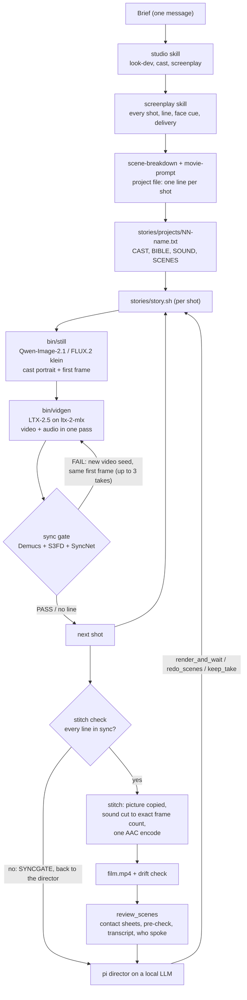
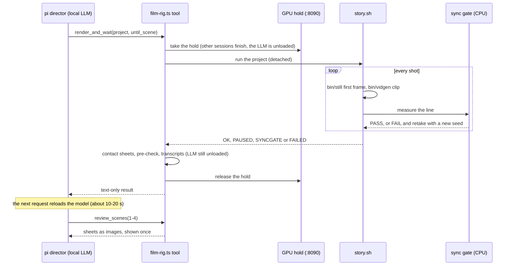

# Architecture: how a brief becomes a film

This is the cleaned design write-up of the rig. The file-by-file map is [`APPARATUS.md`](../APPARATUS.md); the
dialogue-sync work has its own page, [`dialogue-sync.md`](dialogue-sync.md); what each film taught is in
[`iterations.md`](iterations.md).

## The constraint everything is built around

One M5 Max with 128 GB of unified memory runs every model, and the models cannot share the GPU:

- **Two renders at once** swapped 27 GB and ran five times slower each (2026-09-22).
- **An LLM prompted beside a render** slowed the render's refine steps about nine times and produced no answer in four
  minutes (2026-09-23). An idle 90 GB DeepSeek server beside a night of renders cost 8 GB of swap and stretched 720p
  scenes from about 9 to 16-18 minutes.
- **Qwen 27B resident and idle** beside a 480p render cost the render nothing (158.5 s vs 154.4 s), but answering
  mid-render it ran at about 2.5 tok/s instead of 30 (`rig/MEASUREMENTS.md`, E2).

So the rig alternates. The director model writes; a tool unloads it, takes the Mac's GPU hold and renders; the model
reloads on its next request. ds4's disk KV checkpoints make the reload a suffix prefill: the measured wake cost was
about 13 s on a 30k-token context (E1), against 30-60 minutes of rendering in between.

## Pipeline

### The pieces

| piece | what it does | where |
|---|---|---|
| skills | `studio` chains the rest with a check-in dial; `screenplay` writes every shot; `scene-breakdown` turns shots into a project file; `movie-prompt` polishes lines into the model's prompt style; `look-dev` renders three 2 s look tests; `cast` keeps one fixed description per recurring character; `film` renders and reviews; `vidgen` is the single-clip command | `skills/` (Claude Code and pi load the same files) |
| project file | a zsh file: `NAME`, `SIZE`, `SEED`, `CAST` (one sentence per character), `BIBLE` (the style sentence), `SOUND` (ambience), `SCENES` (one continuous shot per line, with tokens such as `[still]`, `[cast=a,b]`, `[layout]`, `[hold]`, `[secs=N]`, `[quality]`) | `stories/projects/` |
| `bin/still` | draws each shot's first frame: Qwen-Image-2.1 from the line, or FLUX.2 klein multi-reference from the cast portraits, so one character keeps one face across shots | `bin/still`, choice in `rig/keyframe/IMAGE-MODEL.md` |
| `bin/vidgen` | the render command: LTX-2.5 int8 through ltx-2-mlx, image-to-video from the still, synchronized audio in the same pass, loudness-normalised to -16 LUFS, a JSON sidecar per clip (prompt, seed, engine command, wall time) | `bin/vidgen` |
| pre-check | model-free checks on six frames per clip (black bars, borders, masks, frozen frames, faces vs the people the line names, brightness, motion) plus a Parakeet transcript of what the audio says | `rig/precheck.py`, `rig/transcribe.py` |
| sync gate | measures each dialogue clip right after it renders and re-renders it with another video seed when the mouth does not follow the voice; refuses to stitch a film with an unsynced line | `rig/sync/gate.py`, `rig/sync/syncmeter.py` |
| stitch | concatenates picture and sound as two exact lists so the voice cannot drift across cuts; `drift.py` checks the result as Apple players play it | `stories/story.sh`, `rig/sync/drift.py` |
| director | a pi extension: four tools, guards (bash cannot start renders, kill or launch model servers), context shaping (a contact sheet is shown once, then replaced by a note) | `rig/film-rig.ts`, `rig/film-director.md`, `rig/film-pi.sh` |

### One render, as a sequence

Why the render result is text only: ds4-server skips its disk KV cache for any request that carries an image, so
sheets inside the render result made every wake re-read the whole context; on one 114-minute run that cost about
21 minutes. The images now arrive in a separate `review_scenes` call and are replaced by a note after the reply.

The GPU hold is a small gate in front of llama-swap, published separately as
[`mthomas100/local-rig`](https://github.com/mthomas100/local-rig). While a render holds it, every LLM client waits
or is refused, so nothing reloads a model onto a busy GPU. Without the gate the tools fall back to "unload, then wait
until wired memory settles".

## Prompt rules the rig learned (with evidence in `skills/film/references/prompt-rules.md`)

- **The style bible goes after the scene, not before.** LTX-2.5 stages whatever the prompt opens with: a leading
  bible gave every scene a 2-6 s prologue of the bible's content.
- **Sound words get drawn.** "A saxophone" in the bible became a saxophone player in four stills, so sound lives only
  in `SOUND=` and the video prompt, never in the image prompt.
- **Famous landmarks are described physically.** The first hands-off film passed a Giza pyramid for the Transamerica
  Pyramid and Big Ben for Coit Tower until the tools printed what each row was asked to show.
- **Who speaks is the real risk, not when.** Name the speaker right before the speech verb and write everyone else as
  "silent, mouth closed"; a pronoun with two men in the frame gave the king's line to the minister.
- **Same text and same seed give the same clip**, so a redo must change one of them; the tools refuse a redo that
  does not.

## Models and memory

| step | model | memory |
|---|---|---|
| directing, planning, reviewing | DeepSeek V4 Flash Vision through ds4-server (or Qwen3.8 27B / Flash Next through llama-server), behind llama-swap | about 93 GB wired for DeepSeek; unloaded during renders |
| first frames and cast portraits | Qwen-Image-2.1, FLUX.2 klein 4B (mflux) | about 46 GB peak, one image at a time |
| video and audio | LTX-2.5 22B DiT int8 + Gemma text encoder (`dgrauet/ltx-2.5-mlx-q8`, 69.6 GiB on disk) | 28 GB peak at 480p, 44.5 GB at 720p, 53 GB for a 15 s portrait clip |
| transcripts | Parakeet TDT 0.6B v3 (mlx-audio) | about 2.6 GB |
| sync gate | Demucs, S3FD, SyncNet v2, MediaPipe Face Landmarker, torchaudio MMS forced alignment | CPU |
| delivery meter (KPIs only) | audeering wav2vec2 MSP-dim, parselmouth | CPU |

The Metal working-set budget on this machine is about 107.5 GiB, so memory is not what limits sharing; compute is.
