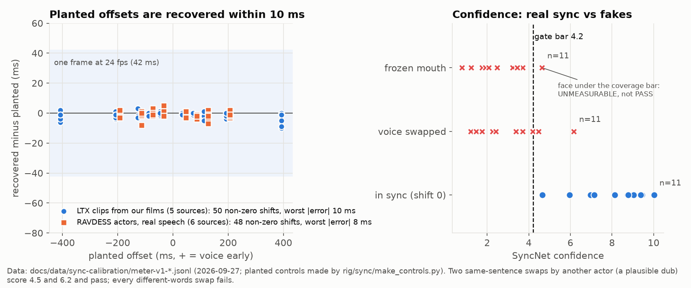
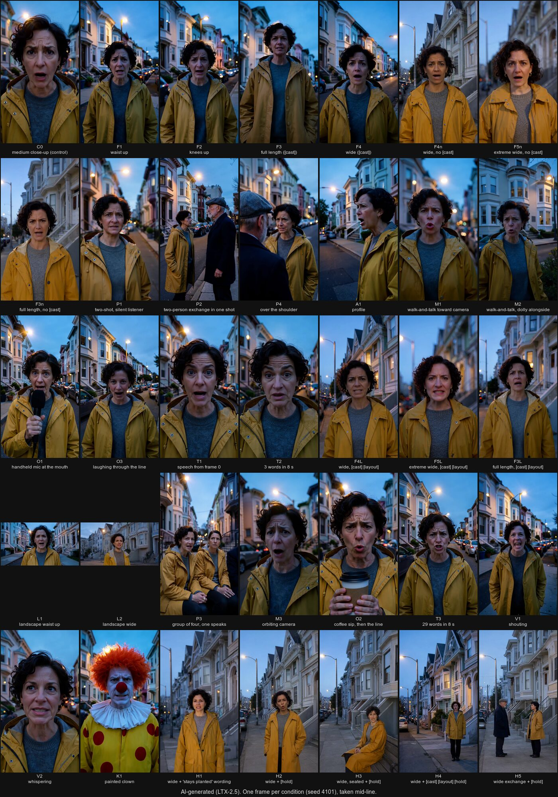
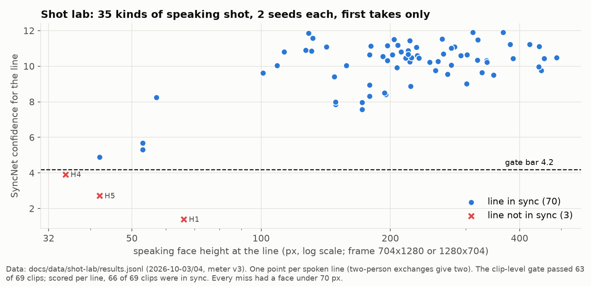
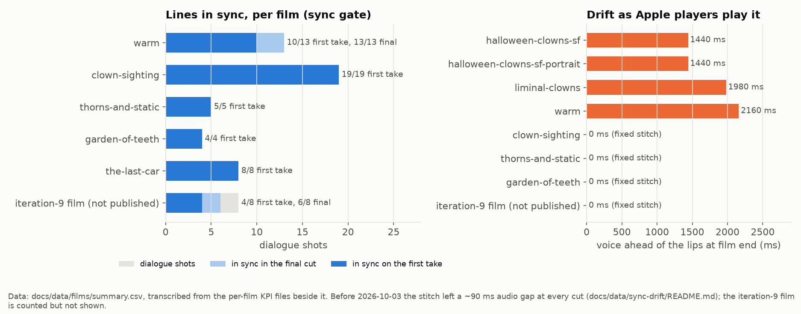

# Dialogue sync: measuring it, gating on it, and what it turned out to be

LTX-2.5 renders the picture and the voice in one pass, so a spoken line can come out in sync, early, late, or in the
wrong mouth. This page is the design and the evidence for the rig's answer: a calibrated meter, a gate that retakes
or refuses, a stitch that cannot drift, and shot rules re-derived from a controlled lab. The full calibration record
is [`rig/sync/CALIBRATION.md`](../rig/sync/CALIBRATION.md); the rows behind every number are in
[`docs/data/`](data/).

A rule from the start: **no human labelling.** Every meter is calibrated against ground truth made by machine
(planted offsets, frozen mouths, swapped voices, a published reference clip, a public dataset of actors), never by
asking a person to watch and rate.

## 1. The first meter was wrong, and that was measurable

The first lip-sync check (`rig/audit/lipsync.py`, mouth-opening vs loudness correlation) reported 9 of 10 lines in
sync on the liminal-clowns film, while a viewer reported that many looked off. On planted controls it passed a
400 ms offset in both directions. It was retired from the stitch.

## 2. The meter (`rig/sync/syncmeter.py`)

All local, all on the CPU, 8-30 s per 8 s clip:

1. **Demucs** (htdemucs) separates the voice from ambience and music.
2. **S3FD** finds faces every second frame (on painted clowns it found 100% of frames, against 13% for MediaPipe
   and 31% for macOS Vision).
3. **SyncNet v2** scores 224 px face crops against the voice, with a sub-frame offset, per face track.
4. **MediaPipe** lips and **torchaudio MMS forced alignment** check that the asked words were spoken, and when.

A clip PASSes when the speaker's track has confidence at least 4.2, the offset is inside +45 / -125 ms (the
broadcast detectability window, BT.1359), the face covers at least half the speech, and at least 60% of the words
align. Each failure gets a cause: M1 offset, M3 the mouth does not follow, M9 another face mouths the line, M10 one
face speaks two people's lines.

### Calibration

- **Planted shifts, -400 to +400 ms**, on five LTX clips from our own films and on six RAVDESS actor recordings:
  every shift recovered within 10 ms (one frame is 42 ms).
- **Frozen mouths, different-words swaps and hidden faces never pass.** The bar of 4.2 sits above every frozen mouth
  and different-words swap (max 3.74) and below every real in-sync take (min 4.66). Two swaps that do pass are the
  same sentence spoken by another actor with nearly the same timing: a plausible dub.
- **The zero point.** The reference clip that SyncNet's authors publish reads +123 ms on this meter against their
  published +120 ms, on every codec and frame-rate path the rig uses (+2 to +10 ms of pipeline error). So the meter's
  zero is SyncNet's zero, and LTX clips read slightly audio-late (median about -41 ms), inside the window.

### Small faces (meter v3, 2026-10-03)

The first gate called any face under 10% of the frame height UNMEASURABLE, and that threshold quietly became a
framing rule: every refused wide shot was rewritten as a close-up. A shrink test (in-sync clips scaled down onto a
grey canvas, then shifted by known amounts) showed the misses were the face detector running at quarter scale, not
SyncNet. With detection at full scale, offsets were recovered within 7 ms on mouths of about 18-23 px. Meter v3
uses a 32 px floor and detects at 0.5 or 1.0 scale.

## 3. The gate (`rig/sync/gate.py`, called from `stories/story.sh`)

- After each dialogue clip renders, the gate measures it. On FAIL or UNMEASURABLE the take is moved aside and the
  shot is re-rendered with another video seed and the same first frame, up to three takes; the best take stays.
- Before the stitch, every line must PASS, or the director must record an explicit exception (`keep_take` with
  `accept_sync_fail`). Otherwise the render tool returns SYNCGATE and the director has to rewrite or accept.
- `[offscreen]` marks a voice that is meant to be heard without a visible mouth.

## 4. The drift that every per-shot meter missed

After the gate, every line of the film "Warm" measured in sync, and the film still looked off. The cause was the
stitch, not the model:

- Each clip carried 8.100 s of AAC audio over 8.042 s of video, and the old stitch re-encoded audio per clip and
  joined with the concat demuxer, leaving a ~90 ms gap in the audio timestamps at every cut.
- QuickTime, iOS and AVFoundation play AAC samples back to back and ignore such gaps, so the voice ran ~90 ms
  earlier after every cut: 1.4-2.2 s early by the end of the four films before the fix.
- Per-shot measurements seek to each shot, which re-anchors audio and video, so they read in sync.

The fixed stitch copies each clip's picture, decodes its sound to PCM, cuts or pads it to exactly its frame count
(2000 samples a frame at 24 fps), and encodes AAC once. `rig/sync/drift.py` now runs after every stitch. Every film
since reads 0 ms. Evidence: [`docs/data/sync-drift/README.md`](data/sync-drift/README.md).

## 5. The shot lab: which shots can carry a line

The old speaking-shot rules (one speaker, medium close-up, face at least 10% of the frame, nothing at the mouth, no
laughing, no movement) were traced back and found to rest mostly on the uncalibrated first meter and on the drift.
So they were re-measured with a controlled lab: the same speaker, the same 14-word line, the same delivery, two seeds,
first takes only, and one factor changed at a time across 35 kinds of shot.

- **66 of 69 first takes were in sync** (exchanges scored per line). Framing, angle (profile at 60-75 degrees),
  movement (walk-and-talk, orbiting camera), props (a mic at the mouth, a coffee sip), laughing, shouting,
  whispering, speech from frame 0, 3 or 29 words in 8 s, a painted clown: all in sync on both seeds.
- **Every miss was a small face**: 100 px or more always in sync, 50-100 px 2 of 3, under 50 px 0 of 2. The meter
  reads 18 px mouths, so these misses are the model's.
- **A speaker drawn small walks to the lens.** In the mosaic the "wide" and "full length" conditions came out as
  medium shots by the time the line is spoken: in 6 of 6 takes the speaker walked in. The `[hold]` token (the shot's
  first frame repeated near the end as a keyframe) kept the framing in 8 of 8 takes.
- **Who speaks is the real risk.** The LTX-2 report says its audio-video attention carries time, not place, and an
  outside human-judged benchmark (MTAVG-Bench) found LTX-2.3's line in the right speaker's mouth only 24% of the
  time. The rig's answer is in the writing (the speaker's name right before every speech verb, everyone else
  "silent, mouth closed") and in the review (a who-spoke image for every shot with two or more faces).

The resulting shot menu is [`skills/film/references/dialogue-shots.md`](../skills/film/references/dialogue-shots.md).
The local director then wrote and directed its own scene from it, "The Last Car": six kinds of speaking shot, 8 of 8
in sync on the first take.

## 6. Per-film results

Read the two panels together: "Warm" had every line in sync per shot and still drifted 2.2 s by its end, which is
why the drift fix mattered more than any prompt rule. The iteration-9 film is the worst result since the gate
landed (4 of 8 lines on the first take, 2 never in sync and accepted as exceptions on the owner's instruction); it
is counted here, but its media is not published.

## 7. What is still open

- The meter cannot tell *which* person spoke: a take where the wrong character speaks, alone, passes. The review's
  who-spoke picture covers it by eye; an active-speaker model or a match against the cast portrait would close it.
- Profiles are measured but uncalibrated.
- The local multimodal judge that was tried (Qwen3-Omni through mlx-vlm) gets no sync vote: its port drops the audio
  tokens and shares no clock between picture and voice, and on planted controls it called every clip "voice early".
- Delivery is measured with an arousal model (AUC 0.92 separating emotional from neutral RAVDESS takes), which is a
  KPI, not a gate.
